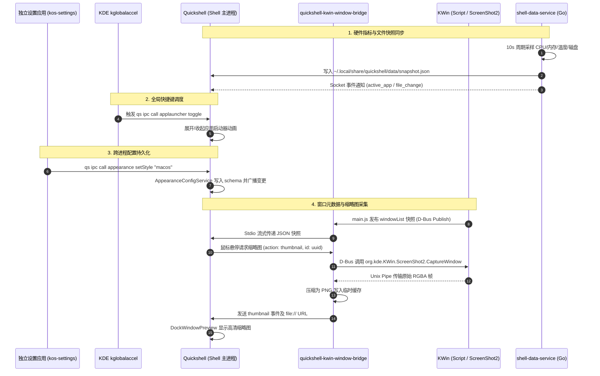

# NextKde (KOS Desktop Shell) 功能架构文档

本文档全面梳理 **NextKde (KOS Desktop Shell)** 的功能模块划分、分层设计、进程边界、跨进程通信管道与硬件交互模型。

---

## 1. 系统总体架构全景

NextKde 采用**双 UI 运行时 + 独立常驻后台服务 + 原生合成器扩展**的多进程混合架构，运行于 **Fedora KDE Plasma 6 (Wayland)** 环境。

```mermaid
graph TD
    subgraph "表现层 (Display Layer - Wayland Layer Shell)"
        QS[Quickshell 0.3.1 运行时<br/>shell.qml / DesktopEnvironment.qml]
        BAR[Top Bar 状态栏]
        DOCK[Liquid Dock 任务栏]
        DC[DeskCenter 桌面层/组件]
        LAUNCHER[AppLauncher 启动器]
        SEARCH[QuickSearch / MRU 窗口切换]
        OVERVIEW[Overview 工作区概览]
        NOTIF[Notifications 通知系统]
        CC[ControlCenter 控制中心]
    end

    subgraph "独立应用层 (Apps Layer)"
        SETTINGS[kos-settings 设置应用<br/>独立 Qt Quick 进程]
    end

    subgraph "数据与通信枢纽层 (Services & IPC)"
        IPC[Quickshell IPC 管道<br/>Unix Domain Socket]
        SDS[shell-data-service<br/>Go 常驻服务 (systemd --user)]
        CLIP[quickshell-file-clipboard-helper<br/>Qt 剪贴板文件协议桥]
    end

    subgraph "原生桥接与合成器扩展层 (Helpers & Integrations)"
        BRIDGE[quickshell-kwin-window-bridge<br/>C++ D-Bus 原生桥接]
        KSCRIPT[KWin Window Bridge Script<br/>KWin JavaScript 引擎]
        EFFECTS[KWin 特效插件<br/>glass.so / dock_anim.so / context_menu.so]
        SHORTCUTS[KDE Command Shortcuts<br/>kglobalaccel 路由]
    end

    subgraph "系统与内核层 (System & Hardware)"
        KWIN[KWin Wayland 合成器<br/>ScreenShot2 / VirtualDesktops]
        POWERDEVIL[KDE PowerDevil<br/>ScreenBrightness / Solid]
        DDC[外接显示器 (DDC/CI) / 硬件背光]
        PIPEWIRE[PipeWire / WirePlumber]
        BLUEZ[BlueZ 蓝牙协议栈]
        SYSFS[/sys/class/hwmon / /sys/class/power_supply]
    end

    %% 表现层内部
    QS --> BAR & DOCK & DC & LAUNCHER & SEARCH & OVERVIEW & NOTIF & CC

    %% 跨层调用与数据流
    SETTINGS <-->|qs ipc call| IPC
    IPC <--> QS
    QS <-->|JSON Snapshot & Unix Socket| SDS
    QS <-->|Unix Pipe / Stdio| BRIDGE
    BRIDGE <-->|D-Bus| KSCRIPT
    KSCRIPT <-->|KWin Scripting API| KWIN
    BRIDGE <-->|org.kde.KWin.ScreenShot2| KWIN
    SHORTCUTS -->|qs ipc call| IPC
    EFFECTS -.->|Compositor Blur / Anim| KWIN
    CC -->|org.kde.ScreenBrightness| POWERDEVIL
    POWERDEVIL -->|DDC/CI / logind| DDC
    CC -->|wpctl / bluetoothctl| PIPEWIRE & BLUEZ
    SDS -->|采样| SYSFS
```

---

## 2. 核心分层与职责划分

| 层次 | 组成部件 | 技术选型 | 核心职责 |
| :--- | :--- | :--- | :--- |
| **表现层 (Shell)** | `desktop/` | QML, QtQuick, Quickshell 0.3.1, GLSL | 承载 Wayland Layer-Shell 表面（Top Bar、Dock、桌面小组件、启动器、通知、搜索、控制中心、工作区概览），实现液态玻璃质感与 iPadOS 交互动效。 |
| **应用层 (Apps)** | `apps/settings/` | C++, Qt 6 Quick, QML | 独立运行的桌面配置中心，通过 Quickshell IPC 读写外观、布局等持久化配置，不占用 Shell 主进程资源。 |
| **数据服务层 (Services)** | `services/shell-data-service` | Go (golang), systemd user unit | 后台异步高频采集 CPU/内存/磁盘/温度/功耗等硬件指标，维护活动账本（Activity Usage），监听桌面文件变更并输出 JSON 快照。 |
| **原生桥接层 (Helpers)** | `helpers/kwin-window-bridge`<br/>`helpers/global-shortcuts` | C++, Qt 6, KWin Scripting, Python | 弥补 Wayland 下 foreign-toplevel 权限限制，提供窗口元数据同步、MRU 排序、D-Bus 授权截图（ScreenShot2）以及全局快捷键注册。 |
| **合成器集成 (Integrations)** | `integrations/kwin-effects-glass`<br/>`integrations/kwin-effects-dock` | C++, OpenGL/GLSL (Dual Kawase + Snell) | 在 KWin 合成器内部实现真正的双重 Kawase 模糊、折射高光与窗口平滑缩放/神奇动画。 |

---

## 3. 功能子系统详解

### 3.1 Top Bar（顶部状态栏）

- **路径**：[`desktop/modules/bar/BarWindow.qml`](file:///home/deadalux/Projects/NextKde/desktop/modules/bar/BarWindow.qml)
- **核心能力**：
  - **动态岛 / 状态区域**：集成网络（Wi-Fi/以太网）、蓝牙、音量、电量与系统托盘（StatusNotifierItem）。
  - **硬件监视挂载**：实时显示 CPU 使用率、温度与内存消耗（数据源由 `MetricsService` 统一收口至 Go 后台服务）。
  - **控制中心触发**：点击或使用快捷键呼出液态磨砂控制中心。
  - **Dock 融合模式**：支持状态栏附件向底部/侧边 Dock 迁移合并（`barIntegratedWithDock`）。

### 3.2 Liquid Dock（动态任务栏）

- **路径**：[`desktop/modules/dock/DockWindow.qml`](file:///home/deadalux/Projects/NextKde/desktop/modules/dock/DockWindow.qml)、[`DockContainer.qml`](file:///home/deadalux/Projects/NextKde/desktop/modules/dock/DockContainer.qml)
- **核心能力**：
  - **自适应几何推导**：基于 [`AdaptiveMath.mjs`](file:///home/deadalux/Projects/NextKde/desktop/modules/dock/AdaptiveMath.mjs)，以 `iconSize` 为唯一自变量，等比缩放高度、边距、圆角与指示器。
  - **智能避让（Smart Auto-Hide）**：实时追踪 KWin 窗口几何与全屏状态，窗口重叠时自动避让滑出屏幕，边缘指示条（Home Indicator）保持触控/鼠标感知。
  - **高清窗口缩略图预览**：鼠标悬停任务图标时，通过 `quickshell-kwin-window-bridge` 经由 `org.kde.KWin.ScreenShot2` 捕获离屏画面，渲染实时液态玻璃预览卡片。
  - **多位置部署**：支持底部（Bottom）、左侧（Left）、右侧（Right）屏幕边缘无损热切换。
  - **综合信息轮播（InfoCarousel）**：支持在 Dock 首尾嵌入天气、音乐播放控制器与时钟挂件。

### 3.3 DeskCenter（桌面层与小组件）

- **路径**：[`desktop/modules/deskcenter/DeskCenterWindow.qml`](file:///home/deadalux/Projects/NextKde/desktop/modules/deskcenter/DeskCenterWindow.qml)
- **核心能力**：
  - **桌面文件管理网格**：消费 `shell-data-service` 生成的 `snapshot.json`，提供文件排序、框选、重命名、拖拽移动、回收站与外部投放（Hold-to-Drop 进度感知）。
  - **系统监控与时间小组件**：无缝贴合桌面背景的毛玻璃系统负载卡片、时钟与日历。
  - **环境壁纸色调感知**：通过 `WallpaperPaletteService` 提取当前壁纸主色与辅色，动态微调玻璃高光与环境反射色。

### 3.4 AppLauncher & QuickSearch（启动器与快速搜索）

- **路径**：[`desktop/modules/applauncher/`](file:///home/deadalux/Projects/NextKde/desktop/modules/applauncher/)、[`desktop/modules/quicksearch/`](file:///home/deadalux/Projects/NextKde/desktop/modules/quicksearch/)
- **核心能力**：
  - **全屏/居中应用抽屉**：分页网格展示、拼音/英文实时搜索过滤、拖拽固定至 Dock。
  - **MRU 窗口切换（Alt+Tab 增强）**：基于 `WindowService._mruOrder` 排序，呼出即可一键切换至最近使用窗口，内嵌实时缩略图。

### 3.5 Overview & Stage Manager（工作区概览）

- **路径**：[`desktop/modules/overview/OverviewWindow.qml`](file:///home/deadalux/Projects/NextKde/desktop/modules/overview/OverviewWindow.qml)
- **核心能力**：
  - **多虚拟桌面切换**：顶栏展示虚拟桌面列表与名称，双向同步 KWin 虚拟桌面状态。
  - **窗口网格与跨桌面迁移**：当前桌面的所有活动窗口平铺展示，支持点击激活、拖拽迁移桌面或键盘导航。

### 3.6 ControlCenter（控制中心）与硬件调控

- **路径**：[`desktop/modules/bar/ControlCenterPanel.qml`](file:///home/deadalux/Projects/NextKde/desktop/modules/bar/ControlCenterPanel.qml)、[`ControlCenterService.qml`](file:///home/deadalux/Projects/NextKde/desktop/modules/bar/ControlCenterService.qml)
- **核心能力**：
  - **声音调控**：对接 PipeWire / WirePlumber (`wpctl`)，实现音量滑动与静音切换。
  - **网络与蓝牙**：对接 NetworkManager 与 BlueZ (`bluetoothctl`)，支持设备连接/断开与列表刷新。
  - **多显示器与外接屏幕亮度**：
    - **第一优先级**：KDE Plasma 6 `org.kde.Solid.PowerManagement.Actions.BrightnessControl` 与 `org.kde.ScreenBrightness`（原生支持通过 DDC/CI 控制 DisplayPort/HDMI 外接显示器与内建屏）。
    - **第二优先级**：降级扫描 `/sys/class/backlight/*` 并通过 logind `SetBrightness` 进行硬件背光写入。
  - **通知历史中心**：归档会话内已处理通知，支持按应用分组、单条删除与一键清空。
  - **已知待解决项（Known Pending Issue）**：在部分 Wayland/Multi-Seat（多席位）或非标准 DisplayManager 配置下，会话切换（Switch User）由于席位通信权限与 VT 切换隔离受限，当前版本暂未完全覆盖全部多席位环境，待后续引入更底层的 session gateway 专有适配。

---

## 4. 跨进程通信与数据流拓扑



---

## 5. 存储与目录结构导航

```text
NextKde/
├── shell.qml                         # Quickshell 唯一主入口 (ShellRoot)
├── PROJECT_CONTEXT.md                # 架构与核心决策上下文索引
├── desktop/                          # 表现层 (Quickshell QML 模块)
│   ├── DesktopEnvironment.qml        # 桌面环境核心拓扑装配器
│   ├── modules/
│   │   ├── applauncher/              # 应用启动器 (网格、搜索、抽屉)
│   │   ├── bar/                      # 顶部状态栏与控制中心 (ControlCenter)
│   │   ├── common/                   # 视觉 Token、液态玻璃基类、服务单例
│   │   ├── deskcenter/               # 桌面小组件、桌面文件管理与网格交互
│   │   ├── dock/                     # 动态自适应任务栏、缩略图、避让控制器
│   │   ├── notifications/            # 桌面通知弹窗与常驻管理
│   │   ├── overview/                 # 工作区概览 (Stage Manager / 虚拟桌面)
│   │   ├── quicksearch/              # 快速搜索与 MRU 窗口切换 (Alt+Tab)
│   │   └── weather/                  # 天气服务与数据组件
│   └── shaders/                      # GLSL 着色器源码及编译脚本 (qsb)
├── apps/                             # 独立 Qt Quick 应用
│   └── settings/                     # kos-settings 桌面设置程序
├── services/                         # 常驻后台服务
│   └── shell-data-service/           # Go 硬件指标采样、账本记录与文件监控
├── helpers/                          # 原生辅助程序与系统桥接
│   ├── kwin-window-bridge/           # KWin 窗口元数据/缩略图 D-Bus 桥接器
│   └── global-shortcuts/             # KDE kglobalaccel 快捷键安装/配置器
├── integrations/                     # 合成器深度扩展
│   ├── kwin-effects-glass/           # KWin Dual Kawase + Snell 液态折射特效
│   └── kwin-effects-dock/            # KWin Dock 窗口缩放动效插件
├── tools/                            # 编译、部署与环境配置自动化脚本
└── docs/                             # 详细子系统架构设计文档
    ├── AppearanceArchitecture.md     # 外观规范与设计 Token 架构
    ├── DockArchitecture.md           # Dock 自适应数学与状态机架构
    ├── FunctionalArchitecture.md     # 本项目功能架构综合文档
    ├── NetworkArchitecture.md        # 网络连接管理架构
    ├── ProjectArchitecture.md        # 运行时隔离与依赖方向规范
    └── ShellDataService.md           # Go 数据服务接口与事件规范
```
